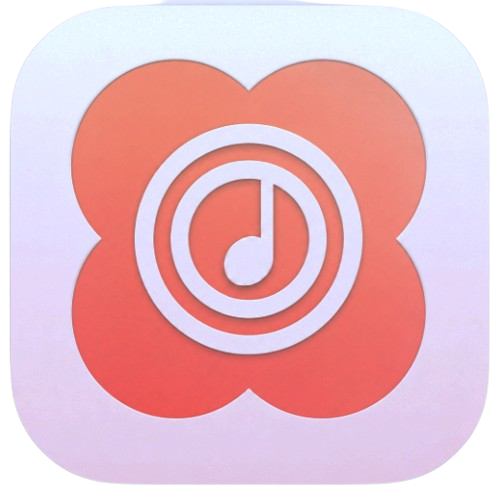
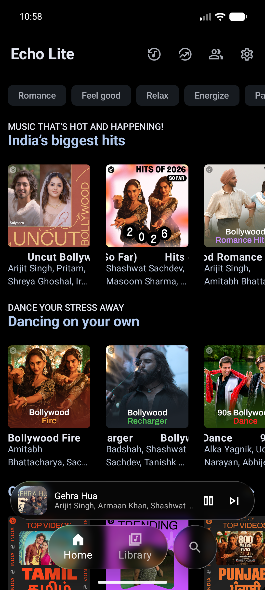
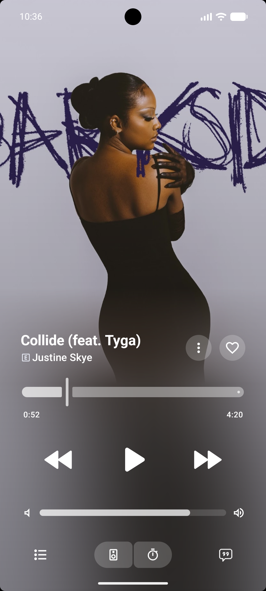
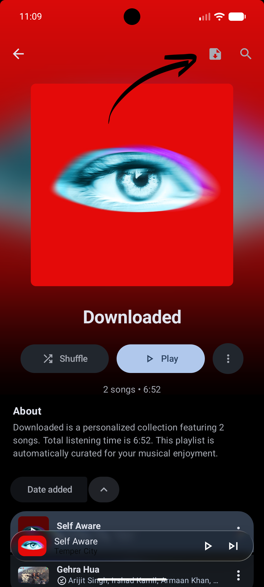

  

<h1 align="center">Echo Lite</h1>

<b>A lighter, ad‑free music app where YOU control updates & suggestions.</b> 
Forked from <a href="https://github.com/EchoMusicApp/Echo-Music">Echo Music</a> (v5.2.89).

<i>Free forever. Your music, your rules.</i>

## 📸 Screenshots

| Home | Player | MP3 Export |
|:---:|:---:|:---:|
|  |  |  |

## ✨ What makes Echo Lite different

- 📤 **One‑tap MP3 export** — export all downloaded songs to any folder
- 🙈 **You control suggestions** — hide unwanted playlist suggestions with one toggle
- 🚫 **No forced updates** — your version stays yours
- ✨ **Polished & light** — smooth, stutter‑free on low‑power phones
- 🎨 **Fresh identity** — new logo & name, same powerful engine

## 📤 One‑tap MP3 export
-  In order to make "one-tap MP3 export" work you have to go to the setting.
-  "Storage" section and Click "Export Folder" choose your Desirable Folder where you can export your songs
-  Now come back to the setting and go to the "Player and Audio" and toggle on "Export as Mp3"
-  Now go the Downloaded songs and you will see a Export Icon Near Search icon on the top right.

## 🙈 You control suggestions
- if you hate suggestion like Trending Community playlists and so on.
- to disable it go to the "content" Section in Settings and Scroll down until you see "Show suggested playlists" under Misc.

## 🎧 Everything you love from Echo Music

- Ad‑free streaming from YouTube Music
- Offline downloads & background playback
- Real‑time synced lyrics
- Song recognition around you
- Material You design

## 📥 Download

👉 **[Get the APK from Releases →](../../releases)**
- The **universal** APK works on every Android device.

## ☕ Support the project

Echo Lite is made by one person. My goal is just **$30/month**.
If it earned you joy, $1/month keeps it alive:

- ☕ [Buy Me a Coffee](https://buymeacoffee.com/boyspot15x)
- or scan the QR inside the app "About"

## 🙏 Credits & License

Built on top of the wonderful **[Echo Music](https://github.com/EchoMusicApp/Echo-Music)** — huge thanks to its original Creators.
Echo Lite is licensed under **GPL‑3.0** (same as upstream). The source stays free, forever.

---
Made with ❤️ by **Spot**
